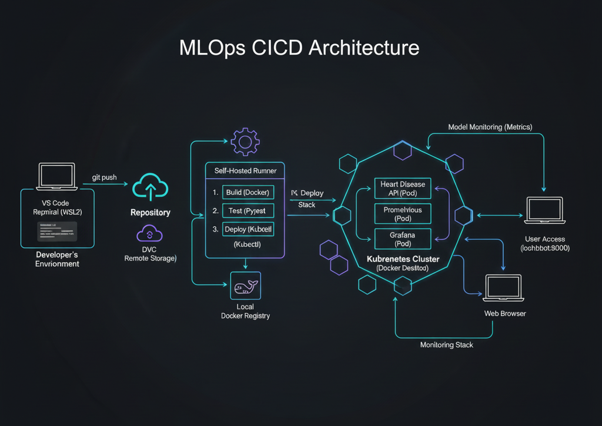

# 🩺 Heart Disease Prediction: MLOps Project Report

This project implements a production-ready machine learning pipeline for predicting heart disease risk. It features automated training, experiment tracking, and a containerized API deployed via Kubernetes.

---

## 🚀 Setup & Installation

### Prerequisites

* **Environment:** Ubuntu WSL2 (recommended) or Linux.
* **Tools:** Docker Desktop (with Kubernetes enabled), Python 3.9+, DVC.

### Installation Steps Manually

1. **Clone the Repository:**
```bash
git clone https://github.com/sre-bhavin/MLOps_Heart_Disease_UCI
cd MLOps_Heart_Disease_UCI

```


2. **Setup Virtual Environment:**
```bash
python -m venv venv
source venv/bin/activate
pip install -r requirements.txt

```


3. **Best Model Finding:**
```bash
dvc repro

```

5. Build the Docker Image locally
```bash
docker build -t heart-disease-api:latest .
```

4. **Local Deployment:**
```bash
kubectl apply -f deployment.yaml
kubectl apply -f monitoring.yaml

```
5. Check deployment status

```batch
kubectl get all
```

6. Call Predict API
```batch
curl --location --request POST 'http://localhost/predict' \
--header 'Content-Type: application/json' \
--data-raw '{
  "age": 83, "sex": 1, "cp": 3, "trestbps": 145, "chol": 433,
  "fbs": 1, "restecg": 0, "thalach": 150, "exang": 0,
  "oldpeak": 2.3, "slope": 0, "ca": 0, "thal": 1
}'
```

7. After creating traffic check monitoring dashboard in Grafana:  [http://localhost:3000](http://localhost:3000)

---
### Deployment from Github Action (CI/CD)

1. Clone Repo

2. Setup Local Self-Hosted Runner

Since we are using Ubuntu WSL2 as our environment, follow these steps to link your local machine as a worker for GitHub.

* Register the Runner on GitHub

    Navigate to your GitHub Repository.

    Go to Settings > Actions > Runners.

    Click the New self-hosted runner button.

    Select Linux as the OS and x64 as the Architecture.

* Install on WSL2

Open your Ubuntu terminal and run the commands provided by GitHub (Example below):
```bash
# Create a dedicated runner directory
mkdir actions-runner && cd actions-runner

# Download the runner package (Verify the version on GitHub)
curl -o actions-runner-linux-x64-X.X.X.tar.gz -L https://github.com/actions/runner/releases/download/vX.X.X/actions-runner-linux-x64-X.X.X.tar.gz

# Extract the installer
tar xzf ./actions-runner-linux-x64-X.X.X.tar.gz

# Configure the runner (Paste the --url and --token from GitHub)
./config.sh --url https://github.com/your-repo --token YOUR_TOKEN_HERE

# Start the runner
./run.sh
```

    Note: When configured, you will see a "Listening for Jobs" message. Keep this terminal open!

3. Trigger the Workflow from the UI

To run the CI/CD pipeline without pushing a code change, we have used the workflow_dispatch event.

Go to github action in repo and click Run.

---
## 📊 EDA & Modelling Choices

### Exploratory Data Analysis (EDA)

* **Key Findings:** * `MaxHR` (Maximum Heart Rate) showed a strong positive correlation with heart disease risk.
* `ExerciseAngina` and `ST_Slope` (Flat/Down) were the most significant categorical predictors.
* Dataset was relatively balanced, but required scaling for numerical features like `Cholesterol`.


* **Preprocessing:** Handled missing values (zeros in Cholesterol) using median imputation and applied `StandardScaler` to all numerical inputs.

### Modeling

* **Choice:** **Random Forest Classifier**.
* **Reasoning:** It handles non-linear relationships and categorical features effectively without extensive tuning.
* **Evaluation Metric:** Prioritized **Recall**, as missing a high-risk patient (False Negative) is more critical in a healthcare context than a False Positive.

---

## 🧪 Experiment Tracking Summary

We used **MLflow** to track all model iterations.

| Run Name | Model | Accuracy | Recall | Parameters |
| --- | --- | --- | --- | --- |
| `baseline_rf` | Random Forest | 84% | 81% | `n_estimators=100` |
| `tuned_rf_v2` | Random Forest | 88% | 91% | `max_depth=10, n_estimators=200` |

> **Artifacts Logged:** Confusion Matrix plots, feature importance charts, and the serialized `.pkl` model files.

---

## 🏗️ Architecture Diagram

The system follows a modular MLOps architecture where data, code, and deployment are decoupled but synchronized.



---

## 🔄 CI/CD & Deployment Workflow

Our pipeline is automated using **GitHub Actions** running on a **Self-Hosted WSL2 Runner**.

### Workflow Stages:

1. **Linting:** Code quality checks using `flake8`.
2. **Unit Testing:** `pytest` validates model loading and API endpoints.
3. **Model Training:** Automated training triggered by data changes in DVC.
4. **Deployment:** Docker image build and `kubectl` rollout to local Kubernetes.

**On any code push to repo, github action will be triggered which will do all validation, model evalaution, will find best model and deploy it to kubernetes enabled in docker desktop.**

---

## 🔗 Project Resources

* **Code Repository** [https://github.com/sre-bhavin/MLOps_Heart_Disease_UCI](https://github.com/sre-bhavin/MLOps_Heart_Disease_UCI)
* **Prediction API** 
```bash
curl --location --request POST 'http://localhost/predict' \
--header 'Content-Type: application/json' \
--data-raw '{
  "age": 83, "sex": 1, "cp": 3, "trestbps": 145, "chol": 433,
  "fbs": 1, "restecg": 0, "thalach": 150, "exang": 0,
  "oldpeak": 2.3, "slope": 0, "ca": 0, "thal": 1
}'
```
* **Monitoring Dashboard - Grafana** [http://localhost:3000](http://localhost:3000)
